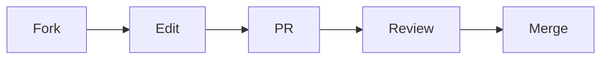

# 💬 Java Chat Application 


A real-time multi-client chat application with sleek UI and emoji support 🔥

## 🌟 Features
| Feature | Symbol |
|---------|--------|
| Multi-threaded Server | 🖥️ |
| Encrypted Connections | 🔒 |
| Emoji Support | 😊 |
| User Notifications | 🔔 |
| Cross-Platform | 🌐 |

## 🛠️ Tech Stack
```diff
+ Java 17
+ Swing GUI
+ TCP/IP Sockets
+ Multi-threading
```

## 🚀 Quick Start
```bash
# Compile
javac -encoding UTF-8 src/**/*.java -d out/

# Run Server
java -cp out/ server.ServerGUI

# Run Client (in new terminal)
java -cp out/ client.ClientGUI
```

## 📸 Screenshots
| Server GUI | Client GUI |
|------------|------------|
|  |  |

## 🌈 Contribution



---

### **🎨 Theme Enhancement Tips**
1. **Add actual screenshots** (replace placeholder links)
2. **Insert demo GIF** (``)
3. **Badge options**:
   ```markdown
   
   
   ```

4. **Colorful code blocks**:
   ````markdown
   ```java
   // Colorful syntax highlighting
   System.out.println("Hello World!"); 
   ```
   ````

---
