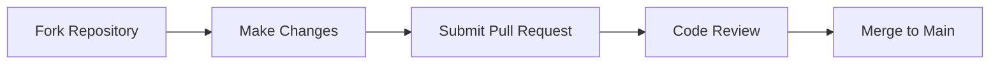

Sure! Here's a more polished and professional rephrased version of your `README` content for the **Java Chat Application**:

---

# 💬 Java Chat Application  
  
  


A real-time, multi-client chat application built with Java, featuring a modern Swing-based GUI and full emoji support. 🚀

---

## 🌟 Key Features

| Feature                 | Emoji |
|-------------------------|-------|
| Multi-threaded Server   | 🖥️     |
| Encrypted Communication | 🔒     |
| Emoji Integration       | 😊     |
| User Notifications      | 🔔     |
| Cross-Platform Support  | 🌐     |

---

## 🛠️ Tech Stack

```diff
+ Java 17
+ Swing (for GUI)
+ TCP/IP Socket Programming
+ Multi-threading
```

---

## 🚀 Getting Started

```bash
# Compile the project
javac -encoding UTF-8 src/**/*.java -d out/

# Run the Server
java -cp out/ server.ServerGUI

# Run the Client (in a separate terminal)
java -cp out/ client.ClientGUI
```

---

## 📸 Screenshot


## 🌈 How to Contribute



---

Let me know if you want to add badges for "Open Source", "Platform", or even a "Live Demo" section!
