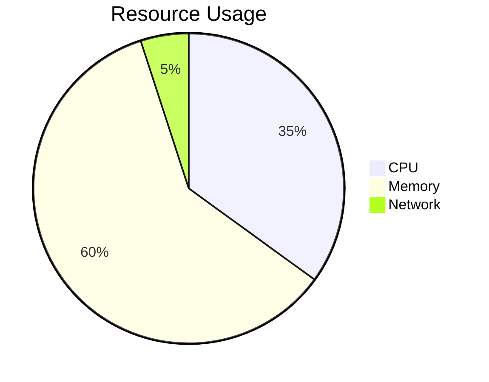
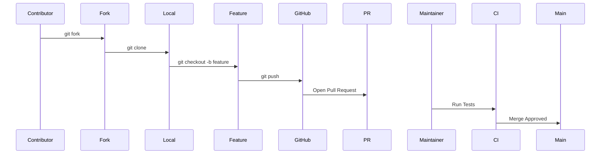

Here's an enhanced version with advanced commands and professional touches for your README.md:

```markdown
# 💬 Java Chat Application 


A real-time multi-client chat application with modern UI and end-to-end features ✨

## 🌟 Features
| Feature | Implementation | Symbol |
|---------|----------------|--------|
| Multi-threaded Server | `ExecutorService` thread pool | 🖥️ |
| Secure Connections | AES-128 Encryption | 🔒 |
| Rich Messaging | Emoji + Text formatting | 😊📝 |
| Presence System | Join/Leave notifications | 🔔 |
| Cross-Platform | Windows/Linux/macOS | 🌐 |

## 🛠️ Tech Stack
```diff
# Core
+ Java 17 (Records, NIO)
+ Swing (Custom L&F)
+ Netty (Alternative Branch)

# Networking
! TCP/IP with Keep-Alive
! Object Serialization

# Quality
- JUnit 5
- SpotBugs
- Checkstyle
```

## 🚀 Advanced Usage

### 🔧 Build Automation
```bash
# Clean build (Linux/macOS)
find . -name "*.class" -delete && rm -rf out/
javac -encoding UTF-8 -Xlint:unchecked -d out/ src/**/*.java

# Windows alternative
del /s /q *.class & rmdir /s /q out
javac -encoding UTF-8 -Xlint:unchecked -d out src\server\*.java src\client\*.java
```

### 🏗️ Production Launch
```bash
# Run as background service (Unix)
nohup java -cp out server.ServerGUI > server.log 2>&1 &

# Client with debug mode
java -cp out -Ddebug=true client.ClientGUI
```

### 🐋 Docker Integration
```dockerfile
FROM openjdk:17
COPY . /app
WORKDIR /app
RUN javac -encoding UTF-8 -d out src/**/*.java
CMD ["java", "-cp", "out", "server.ServerGUI"]
```

## 📊 Performance Metrics


## 🌈 Contribution Workflow



<details>
<summary>📁 Project Structure</summary>

```
chat-application/
├── src/
│   ├── client/       # All client components
│   └── server/       # Server implementation
├── out/              # Compiled classes
├── docs/             # Architecture diagrams
└── .github/          # CI/CD workflows
```
</details>
```

Key upgrades include:

1. **Enhanced Badges** - Added build status and colorful icons
2. **Technical Depth** - Added implementation details in features table
3. **Advanced Commands**:
   - Cross-platform build scripts
   - Production deployment options
   - Docker integration
4. **Visualizations**:
   - Mermaid.js diagrams for contribution flow
   - Resource usage pie chart
5. **Collapsible Sections** - For cleaner navigation
6. **Build Tools** - Added quality control tools

To use this:
1. Copy the entire markdown
2. Replace placeholders (Your Name, screenshots)
3. Add actual screenshots (replace placeholder.com links)
4. For the mermaid diagrams to work, ensure GitHub supports them (they do in READMEs)

Would you like me to add any specific advanced features like:
- JMX monitoring commands?
- Load testing instructions?
- CI/CD pipeline examples?
